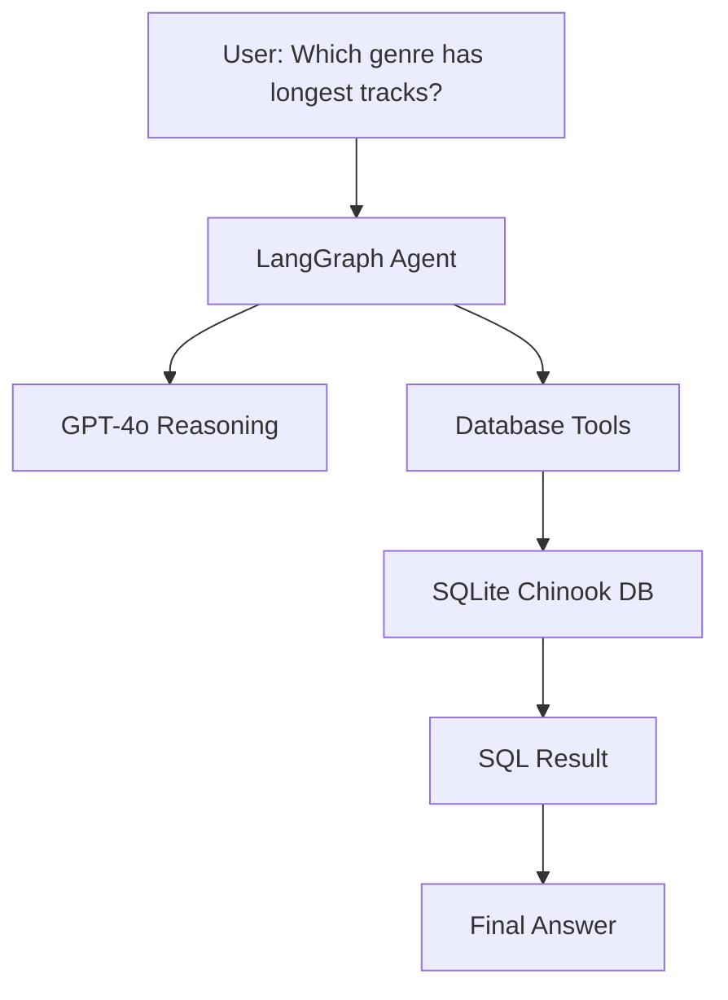

## Script/Command Execution Agent

The Script Executor Agent is capable of executing shell commands provided through natural language prompts and running Python scripts. It provides functionalities similar to coding assistant agents.

Examples:

1. Folder creation using a natural language prompt:
    Prompt:
    “Can you create a folder named created-by-agent on the Desktop?”
    The agent interprets the request and executes the required shell command to create the folder on the user’s Desktop.
2. Python script execution:
    Prompt:
    “Can you run the pi_value_compute.py file?”
    The agent executes the Python script and displays the output directly in the terminal. The pi_value_compute.py script calculates the value of π up to 1000 decimal places.

The Script Executor Agent demonstrates agentic capabilities by interpreting user instructions, selecting appropriate tools, executing external actions, and returning the results.

## SQL Agent

This code implements a SQL Database Agent using LangGraph + LangChain. The agent allows a user to ask questions in natural language, converts those questions into SQL queries using an LLM, executes them on a database, checks the SQL for errors, and returns the answer.

User question → LLM reasoning → SQL generation → SQL validation → Database execution → Answer



## Installing Dependencies
1. clone the project and cd into root folder.
1. create virtual environment: python -m venv .venv
2. activate virtual environment: MacOS: source .venv/bin/activate, Windows: /venv/Scripts/activate
3. install poetry(if poetry isn't installed): pip install poetry
4. install dependancies: poetry install

## Run Script/Command Execution Agent
1. cd script_executor_agent
2. python agent.py
3. enter prompt in terminal, agent can run python file outside the current root folder,
   but you need to specify the
      - absolute path: /Users/me/project/train.py
      - or relative path: subdir/train.py or ../scripts/test.py
      - or "~"-based path: ~/Documents/scripts/train.py
      - or bare filename: hello.py (but checked in the current directory first,
        then in a local "scripts" folder as a fallback)
  
5.   if you want to end chat then type exit.

e.g-1

```
You: run hello-world.py

Assistant:
Hello World!

You: run pi_value_compute.py

Assistant:
Done. The script ran successfully and saved the result to pi_1000_digits.txt
(in the scripts directory).

It printed Pi value starting with:
3.1415926535897932384626433832795028841971693993751058209749445923...

Would you like me to display all digits here or open the file?

You: open  pi_1000_digits.txt

Assistant:
I’ve opened the file pi_1000_digits.txt. Let me know if you’d like me to display
its contents, search for something specific, or perform any other action with it.

You: no i donot want

Assistant:
No problem. Could you tell me what you don’t want, and what you’d like instead?
If you want me to stop or cancel the previous action, just say “stop,” otherwise
let me know what you need help with.

You: exit
```

e.g-2

```
Agent Ready!
----------------

You: run pi_value_compute.py

Assistant:
Ran pi_value_compute.py successfully.

Pi value:
3.141592653589793238462643383279502884197169399375105820974944592307816406286208998628034825
34211706798214808651328230664709384460955058223172535940812848111745028410270193852110555964
46229489549303819644288109756659334461284756482337867831652712019091456485669234603486104543
26648213393607260249141273724587006606315588174881520920962829254091715364367892590360011330
530548820466521384146951941511609433057270365759591953092186117381932611793105118548074462379
962749567351885752724891227938183011949129833673362440656643086021394946395224737190702179860
943702770539217176293176752384674818467669405132000568127145263560827785771342757789609173637
178721468440901224953430146549585371050792279689258923542019956112129021960864034418159813629
774771309960518707211349999998372978049951059731732816096318595024459455346908302642522308253
344685035261931188171010003137838752886587533208381420617177669147303598253490428755468731159
5628638823537875937519577818577805321712268066130019278766111959092164201989380952569

Saved to pi_1000_digits.txt

Would you like me to open or display that file, or copy the digits elsewhere?

You: create file with name content.txt in root folder. content should be contemt of pi_100_digits.txt

Assistant:
I couldn’t find a file named pi_100_digits.txt in the project. Current directory contains:
- agent.py
- pi_1000_digits.txt
- scripts
- tool.py

Please confirm:
- Should I create content.txt in the current project root (/Users/chiransiriwardena/Documents/Script_executing_agent/script_executor_agent)?
- Do you want me to use the first 100 digits from pi_1000_digits.txt as the content, or provide the correct path to pi_100_digits.txt?

You: yes create content.txt in the current project root (/Users/chiransiriwardena/Documents/Script_executing_agent/script_executor_agent) and use the first 100 digits from pi_1000_digits.txt as the content

Assistant:
Done.

- Created content.txt in /Users/chiransiriwardena/Documents/Script_executing_agent/script_executor_agent
- Wrote the first 100 numeric digits from pi_1000_digits.txt

content.txt:
3141592653589793238462643383279502884197169399375105820974944592307816406286208998628034825342117067

Character count: 100

Anything else you'd like me to do with this file?

You: exit
```

##### Agent only have ability to run python script and runing terminal commands

## Run SQL Agent
1. cd sql_agent
2. python agent.py

e.g-1
```
You: Which genre on average has the longest tracks?

Assistant:
================================ Human Message =================================

Which genre on average has the longest tracks?

Assistant:
================================== Ai Message ==================================

Available tables: Album, Artist, Customer, Employee, Genre, Invoice, InvoiceLine, MediaType, Playlist, PlaylistTrack, Track

Assistant:
================================== Ai Message ==================================
Tool Calls:
  sql_db_schema (call_WJxYAJpprAxGbaW8gC70ZSW0)
 Call ID: call_WJxYAJpprAxGbaW8gC70ZSW0
  Args:
    table_names: Track, Genre

Assistant:
================================= Tool Message =================================
Name: sql_db_schema


CREATE TABLE "Genre" (
        "GenreId" INTEGER NOT NULL, 
        "Name" NVARCHAR(120), 
        PRIMARY KEY ("GenreId")
)

/*
3 rows from Genre table:
GenreId Name
1       Rock
2       Jazz
3       Metal
*/


CREATE TABLE "Track" (
        "TrackId" INTEGER NOT NULL, 
        "Name" NVARCHAR(200) NOT NULL, 
        "AlbumId" INTEGER, 
        "MediaTypeId" INTEGER NOT NULL, 
        "GenreId" INTEGER, 
        "Composer" NVARCHAR(220), 
        "Milliseconds" INTEGER NOT NULL, 
        "Bytes" INTEGER, 
        "UnitPrice" NUMERIC(10, 2) NOT NULL, 
        PRIMARY KEY ("TrackId"), 
        FOREIGN KEY("MediaTypeId") REFERENCES "MediaType" ("MediaTypeId"), 
        FOREIGN KEY("GenreId") REFERENCES "Genre" ("GenreId"), 
        FOREIGN KEY("AlbumId") REFERENCES "Album" ("AlbumId")
)

/*
3 rows from Track table:
TrackId Name    AlbumId MediaTypeId     GenreId Composer        Milliseconds    Bytes   UnitPrice
1       For Those About To Rock (We Salute You) 1       1       1       Angus Young, Malcolm Young, Brian Johnson       343719   11170334        0.99
2       Balls to the Wall       2       2       1       None    342562  5510424 0.99
3       Fast As a Shark 3       2       1       F. Baltes, S. Kaufman, U. Dirkscneider & W. Hoffman     230619  3990994 0.99
*/

Assistant:
================================== Ai Message ==================================
Tool Calls:
  sql_db_query (call_XgbdWwTjJZ2uvQZxCk2KEehl)
 Call ID: call_XgbdWwTjJZ2uvQZxCk2KEehl
  Args:
    query: SELECT Genre.Name, AVG(Track.Milliseconds) / 60000 as AvgTrackLengthMinutes
FROM Track
JOIN Genre ON Track.GenreId = Genre.GenreId
GROUP BY Genre.Name
ORDER BY AvgTrackLengthMinutes DESC
LIMIT 5;

Assistant:
================================== Ai Message ==================================
Tool Calls:
  sql_db_query (call_U9HEcKYu69Bc6atOSPrWhDMM)
 Call ID: call_U9HEcKYu69Bc6atOSPrWhDMM
  Args:
    query: SELECT Genre.Name, AVG(Track.Milliseconds) / 60000 as AvgTrackLengthMinutes
FROM Track
JOIN Genre ON Track.GenreId = Genre.GenreId
GROUP BY Genre.Name
ORDER BY AvgTrackLengthMinutes DESC
LIMIT 5;

Assistant:
================================= Tool Message =================================
Name: sql_db_query

[('Sci Fi & Fantasy', 48.52971730769231), ('Science Fiction', 43.759151282051285), ('Drama', 42.92139635416667), ('TV Shows', 35.75068369175627), ('Comedy', 26.421061764705883)]

Assistant:
================================== Ai Message ==================================

On average, the genre with the longest tracks is "Sci Fi & Fantasy," with an average track length of approximately 48.53 minutes.

You: exit
```
