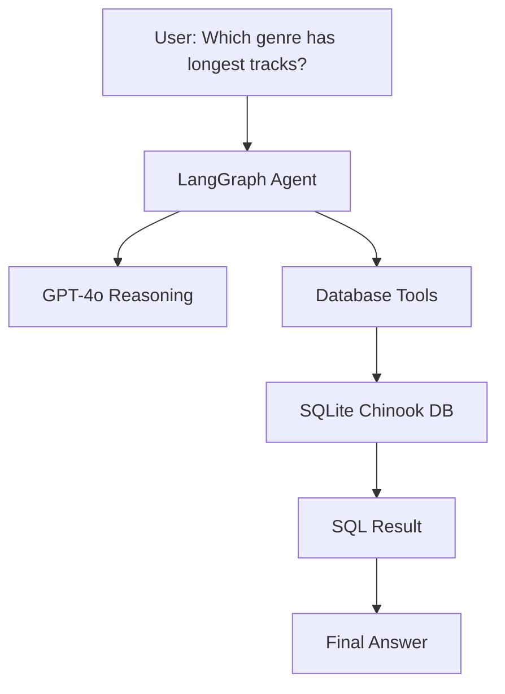

## Script/Command Execution Agent

The Script Executor Agent is capable of executing shell commands provided through natural language prompts and running Python scripts. It provides functionalities similar to coding assistant agents.

Examples:

1. Folder creation using a natural language prompt:
    Prompt:
    “Can you create a folder named created-by-agent on the Desktop?”
    The agent interprets the request and executes the required shell command to create the folder on the user’s Desktop.
2. Python script execution:
    Prompt:
    “Can you run the pi_value_compute.py file?”
    The agent executes the Python script and displays the output directly in the terminal. The pi_value_compute.py script calculates the value of π up to 1000 decimal places.

The Script Executor Agent demonstrates agentic capabilities by interpreting user instructions, selecting appropriate tools, executing external actions, and returning the results.

## SQL Agent

This code implements a SQL Database Agent using LangGraph + LangChain. The agent allows a user to ask questions in natural language, converts those questions into SQL queries using an LLM, executes them on a database, checks the SQL for errors, and returns the answer.

User question → LLM reasoning → SQL generation → SQL validation → Database execution → Answer



## Installing Dependencies
1. clone the project and cd into root folder.
1. create virtual environment: python -m venv .venv
2. activate virtual environment: MacOS: source .venv/bin/activate, Windows: /venv/Scripts/activate
3. install poetry(if poetry isn't installed): pip install poetry
4. install dependancies: poetry install

## Run Script/Command Execution Agent
1. cd script_executor_agent
2. python agent.py
3. enter you prompt in terminal, if you want to end chat then type exit.

e.g

```
You: run hello-world.py

Assistant:
Hello World!

You: run pi_value_compute.py

Assistant:
Done. The script ran successfully and saved the result to pi_1000_digits.txt
(in the scripts directory).

It printed Pi value starting with:
3.1415926535897932384626433832795028841971693993751058209749445923...

Would you like me to display all digits here or open the file?

You: open  pi_1000_digits.txt

Assistant:
I’ve opened the file pi_1000_digits.txt. Let me know if you’d like me to display its contents, search for something
specific, or perform any other action with it.

You: no i donot want

Assistant:
No problem. Could you tell me what you don’t want, and what you’d like instead? If you want me to stop or cancel the
previous action, just say “stop,” otherwise let me know what you need help with.

You: exit
```

##### Agent only have ability to run python script and runing terminal commands

## Run SQL Agent
1. cd sql_agent
2. python agent.py
