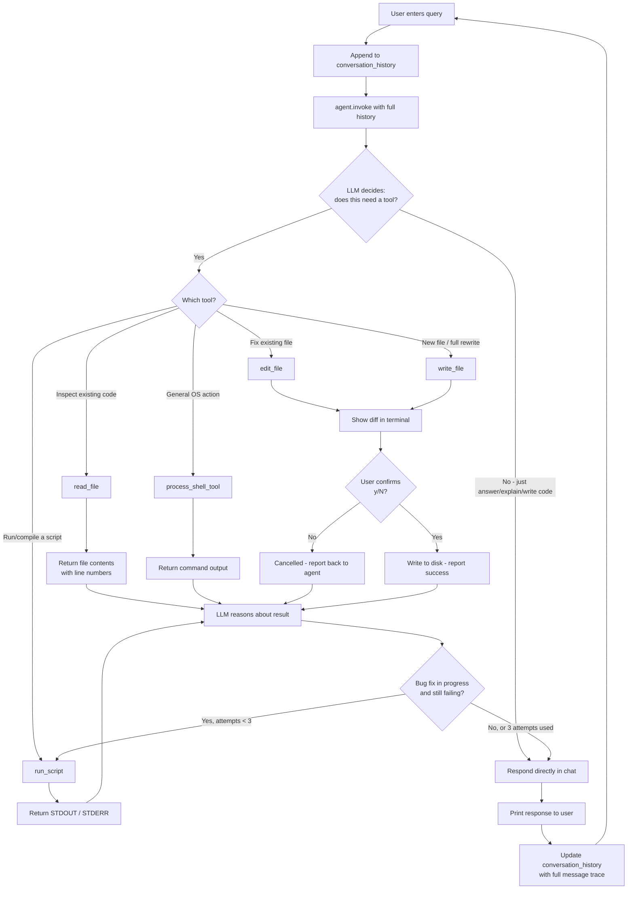
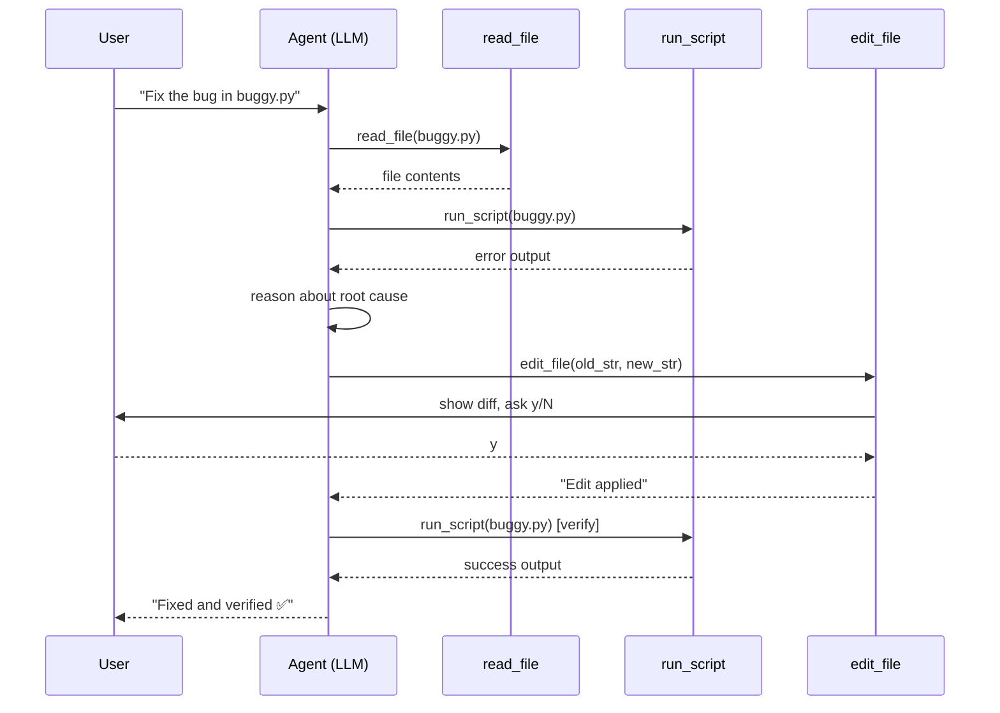

## 1. Coding Assistant Agent

The Coding Assistant is capable of writing programs, modifying or fixing issues while executing terminal commands provided as tools. I
The Coding Assistant demonstrates agentic capabilities by interpreting user instructions, selecting appropriate tools, executing external actions, and returning the results.

## Agent Workflow



### Debug Loop Detail



## Run Coding Assistant Agent
1. cd script_executor_agent
2. python agent.py
3. enter prompt in terminal, agent can run python file outside the current root folder,
   but you need to specify the
      - absolute path: /Users/me/project/train.py
      - or relative path: subdir/train.py or ../scripts/test.py
      - or "~"-based path: ~/Documents/scripts/train.py
      - or bare filename: hello.py (but checked in the current directory first,
        then in a local "scripts" folder as a fallback)
  
5.   if you want to end chat then type exit.

#### prompt: write a program to print first 10 fibonacci numbers in C++

```
python agent.py
Agent Ready!
----------------

You: write a program to print first 10 fibonacci numbers in C++

Assistant:
Here’s a simple C++ program that prints the first 10 Fibonacci numbers (starting from 0):

#include <iostream>
int main() {
    const int n = 10;
    long long a = 0, b = 1;
    for (int i = 0; i < n; ++i) {
        std::cout << a;
        if (i < n - 1) std::cout << ' ';
        long long next = a + b;
        a = b;
        b = next;
    }
    std::cout << std::endl;
    return 0;
}

You: can you run above generated fibonacci program and show me output

Assistant:
Here’s the output of running the C++ Fibonacci program:

0 1 1 2 3 5 8 13 21 34

You: how you run fibonacci program ?

Assistant:
I saved the code to a file named fib.cpp, then compiled and executed it. In my environment I used a run tool that automatically does:
- Compile with g++ (equivalent to: g++ -O2 -std=c++17 fib.cpp -o fib)
- Run the produced binary (equivalent to: ./fib)

How you can run it locally:
- On macOS/Linux:
  - Save as fib.cpp
  - g++ -O2 -std=c++17 fib.cpp -o fib
  - ./fib
- On Windows (MinGW):
  - g++ -O2 -std=c++17 fib.cpp -o fib.exe
  - .\fib.exe
- On Windows (MSVC):
  - cl /EHsc fib.cpp
  - fib.exe
```

#### prompt: fix bugs in fib.cpp

```
python agent.py 
Agent Ready!
----------------

You: fix bugs in fib.cpp

--- Proposed change to /Users/chiransiriwardena/Documents/Script_executing_agent/coding_assistant/fib.cpp ---
--- /Users/chiransiriwardena/Documents/Script_executing_agent/coding_assistant/fib.cpp
+++ /Users/chiransiriwardena/Documents/Script_executing_agent/coding_assistant/fib.cpp
@@ -1,6 +1,6 @@
 #include <iostream>
 int main() {
-    const n = 10;
+    const int n = 10;
     long long a = 0, b = 1;
     for (int i = 0; i < n; ++i) {
         std::cout << a;
--- end of proposed change ---
Apply this change to /Users/chiransiriwardena/Documents/Script_executing_agent/coding_assistant/fib.cpp? [y/N]: y

Assistant:
I fixed the compile error and verified the program runs correctly.

Change made:
- Declared the constant with an explicit type:
  - const int n = 10;

Current output when running fib.cpp:
0 1 1 2 3 5 8 13 21 34

If you’d like, I can also:
- Add input handling to generate the first n Fibonacci numbers from user input.
- Format output differently (e.g., comma-separated, newline-separated).
- Use vector storage or big integers for larger sequences.

You: can you Add input handling to generate the first n Fibonacci numbers from user input.

--- Proposed change to /Users/chiransiriwardena/Documents/Script_executing_agent/coding_assistant/fib.cpp ---
--- /Users/chiransiriwardena/Documents/Script_executing_agent/coding_assistant/fib.cpp
+++ /Users/chiransiriwardena/Documents/Script_executing_agent/coding_assistant/fib.cpp
@@ -1,6 +1,11 @@
 #include <iostream>
 int main() {
-    const int n = 10;
+    std::cout << "Enter n: ";
+    int n;
+    if (!(std::cin >> n) || n < 0) {
+        std::cerr << "Please enter a non-negative integer." << std::endl;
+        return 1;
+    }
     long long a = 0, b = 1;
     for (int i = 0; i < n; ++i) {
         std::cout << a;
--- end of proposed change ---
Apply this change to /Users/chiransiriwardena/Documents/Script_executing_agent/coding_assistant/fib.cpp? [y/N]: y

10

Assistant:
Done. I added a prompt and input validation so the program reads n from stdin and prints the first n Fibonacci numbers.

Updated fib.cpp:
#include <iostream>
int main() {
    std::cout << "Enter n: ";
    int n;
    if (!(std::cin >> n) || n < 0) {
        std::cerr << "Please enter a non-negative integer." << std::endl;
        return 1;
    }
    long long a = 0, b = 1;
    for (int i = 0; i < n; ++i) {
        std::cout << a;
        if (i < n - 1) std::cout << ' ';
        long long next = a + b;
        a = b;
        b = next;
    }
    std::cout << std::endl;
    return 0;
}

How to run:
- Compile and run, then enter a number when prompted.
- Non-interactive example:
  - macOS/Linux: echo 10 | ./a.out
  - Windows (PowerShell): 10 | .\a.exe

Want me to also handle larger n (e.g., switch to 128-bit or big integers) or change the output format?

You: can you rub code for this n=10

Assistant:
Here’s the output for n = 10:
0 1 1 2 3 5 8 13 21 34

You: exit
```


#### prompt: Runing Rust program

```
python agent.py
Agent Ready!
----------------

You: can you run ~/Documents/Rust/Rust/src/test.rs    

Assistant:
Output:
Hello, world!
The value of x is: 7
The value of x is: 8
The value of y is: true
The interproduct of 1, 2, and 3 is: 11

You: I want to see the code's source 

Assistant:
Here is the source for ~/Documents/Rust/Rust/src/test.rs:

fn interproduct(a: i32, b: i32, c: i32) -> i32 {
    return a *b + b * c + c * a;
}


fn main() {
    println!("Hello, world!");

    let _x_ = 6;
    let x = 7;

    println!("The value of x is: {}", x);

    let x = x + 1;
    println!("The value of x is: {}", x);

    let y: bool = true;
    println!("The value of y is: {}", y);

    println!("The interproduct of 1, 2, and 3 is: {}", interproduct(1, 2, 3));
}

You: can you modify the test.rs file to increment x by one and print incremented at last line

Assistant:
Done. I updated test.rs to increment x by one at the end and print "incremented: ...".

Current source:
fn interproduct(a: i32, b: i32, c: i32) -> i32 {
    return a * b + b * c + c * a;
}

fn main() {
    println!("Hello, world!");

    let _x_ = 6;
    let x = 7;

    println!("The value of x is: {}", x);

    let x = x + 1;
    println!("The value of x is: {}", x);

    let y: bool = true;
    println!("The value of y is: {}", y);

    println!("The interproduct of 1, 2, and 3 is: {}", interproduct(1, 2, 3));

    let x = x + 1;
    println!("incremented: {}", x);
}

Program output:
Hello, world!
The value of x is: 7
The value of x is: 8
The value of y is: true
The interproduct of 1, 2, and 3 is: 11
incremented: 9

Want me to keep the earlier prints or change it to only print the final incremented value?
```
